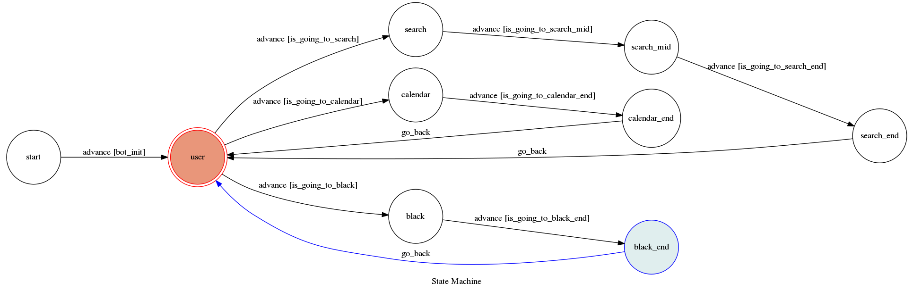

# TOC Project 2017

A telegram bot based on a finite state machine

contributed by `rayleigh0407`

## Setup

### Prerequisite
* Python 3

```shell
sudo apt-get install python3-all python3-pip
```

### Install Dependency


```shell
pip3 install -r requirements.txt
```


* pygraphviz (For visualizing Finite State Machine)
    * [Setup pygraphviz on Ubuntu](http://www.jianshu.com/p/a3da7ecc5303)


### Run the Server

```shell
$ sh chat_shell.sh
```

## Finite State Machine


## Usage

一開始有三個功能可以選

1. **課程查詢** 
    - **依名稱查詢**
      輸入課程名稱，或是簡稱，即可對所有系搜尋相似之課程資訊
    - **依編號查詢** 
      輸入課程編號（系所編號可打可不打），可查詢相對應編號的課程資訊
    - **依系所查詢**
      輸入某系所，可取得該系所有的課程資訊
2. **課表安排**
    輸入相關的課程的系所編號及課程編號
    可將該課加入課程表
    輸入ok後即可輸出課程表
3. **更多功能**
    此功能是為貪慾之人所設的一個陷阱
    只要是想搶涼爽課的人
    都會被此系統狠狠的教訓
    始其痛改前非
    好好認真唸書
    
### Bot link
[nigganiggabot](https://telegram.me/nigganiggabot)
## Author
[rayleigh0407](https://github.com/rayleigh0407)
